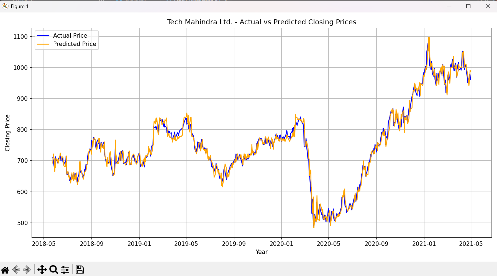

# Stock Price Prediction for Nifty 50 

Predict next-day closing prices using historical data and Random Forest Regression.  
  

---

##  Key Features  
- Predicts stock prices for **50 Nifty companies**  
- Achieves **<5% MAPE** (Mean Absolute Percentage Error)  
- Minimalist design with **5-day lag features**  
- Models saved as `.pkl` files for reproducibility  


---

##  Installation  
1. Clone repository:  
```bash
git clone https://github.com/Krishna-Das20/Stock_Prediction.git
```  

2. Install dependencies:  
```bash
pip install pandas scikit-learn matplotlib pickle
```

---

##  Usage  
Run predictions for any Nifty 50 company:  
```bash 
python stock_prediction.py
```  
**Follow terminal prompts:**  
```
Please choose a company to train the model on:
1. Adani Ports
2. Asian Paints
...
50. Zee Entertainment

Enter serial number: 25
```

---

##  Results  
**Tech Mahindra Prediction**  
  

| Metric | Value |  
|--------|-------|  
| MSE    | 302   |  
| MAPE   | 1.76% |  

---

## Technical Details  
**Algorithm**: `RandomForestRegressor` (100 trees)  
**Features**: `lag_1` to `lag_5` (5-day closing prices)  


---

##  References  
- [scikit-learn Documentation](https://scikit-learn.org/stable/modules/generated/sklearn.ensemble.RandomForestRegressor.html)  
- **Dataset**: [Nifty50 Stock Data](https://www.kaggle.com/datasets/rohanrao/nifty50-stock-market-data)  


---

## Contact at:
 krishnadas2806@gmail.com  
 [GitHub Profile](https://github.com/Krishna-Das20)
